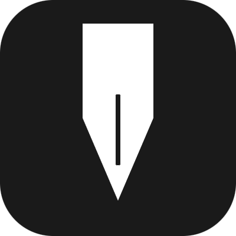

<h1 align="center">影迹</h1>
<h6 align="center">Shadow Diary</h6>

<p align="center">
  
</p>

<p align="center">影迹是一个本地优先的日记应用, 基于Flutter构建</br>
寻找<a href="https://github.com/GinHsYr/ShadowDiary">桌面端</a></p>
## 当前能力

- 跟随系统/浅色/深色模式、中性黑与三种预设色，以及 Monet 系统动态取色
- 跟随系统、简体中文和英文切换
- 与桌面端 一致的 SQLite 表、索引、外键、WAL 和 FTS5 触发器
- 生物识别、局域网发现、WebSocket 同步和 HTML 编辑器转换接口

日记 CRUD、富文本编辑、日历数据接入、图片预览、档案和同步业务将在后续阶段实现。

## 开发

环境要求：Flutter 3.44.6、Dart 3.12.2、Android SDK、JDK 17。

```bash
flutter pub get
flutter analyze
flutter test
flutter build apk --debug
```

Android applicationId：`com.shadowdiary.hsyr`。
